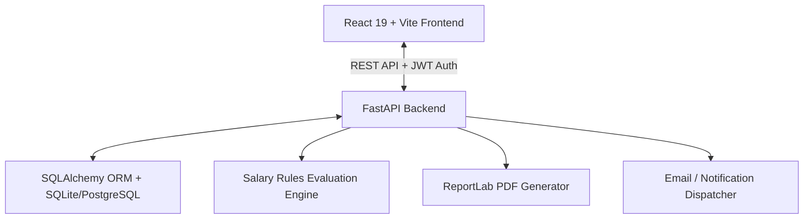
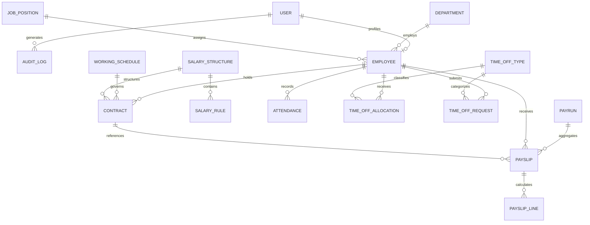
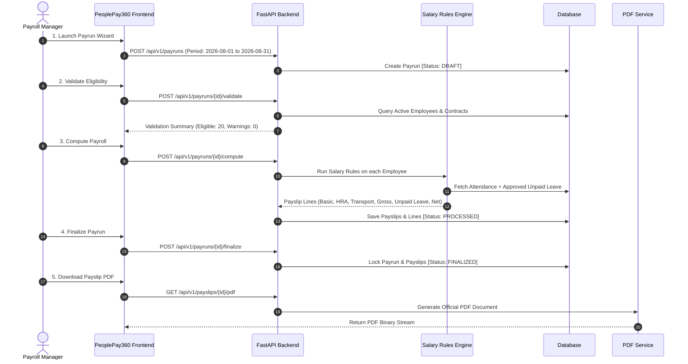

# PeoplePay360 — System Architecture & Design

## 1. System Overview

**PeoplePay360** is a modern, full-stack Human Resources and Automated Payroll Management platform designed to solve the disconnection between employee lifecycle operations (attendance, time off, contracts, working schedules) and payroll computations.

---

## 2. Core Architecture Layers

### A. Frontend Client Layer (`/frontend`)
- **Framework**: React 19 with Vite 8 & TypeScript.
- **Styling**: Tailwind CSS v4 design system with glassmorphism, modern gradients, responsive layouts, and unified color palettes.
- **State & Context**:
  - `AuthContext`: Manages JWT access tokens, active user profiles, role-based route guardrails, and persistent sessions.
  - `ToastContext`: Dynamic notifications for operations, warnings, and calculations.
- **Routing**: `react-router-dom` with role-aware route guards (`Admin`, `HR Manager`, `Payroll Manager`, `Employee`).
- **Data Visualization**: Recharts for dynamic payroll distributions, historical salary trends, and department analytics.

### B. Application Server Layer (`/backend`)
- **Framework**: FastAPI (Python 3.12+).
- **Security & RBAC**:
  - OAuth2 Password Bearer with JWT (HS256 tokens).
  - Fine-grained permission decorators (`require_roles(["ADMIN", "PAYROLL_MANAGER"])`).
- **RESTful Endpoints (`/app/api/v1`)**:
  - Modular routers for Auth, Users, Employees, Contracts, Working Schedules, Attendance, Time Off, Salary Structures, Salary Rules, Payruns, Payslips, and Dashboard Analytics.

### C. Business Engine Layer (`/backend/app/services`)
- **Salary Computation Engine (`salary_engine.py`)**:
  - Topological rule execution by sequence.
  - Dynamic evaluation of Python mathematical formulas (`contract.wage * 0.40`, `worked_days / total_days`).
  - Safe mathematical context preventing code injection.
  - Automated deduction calculation for unpaid leave days and attendance anomalies.
- **Payrun Wizard Engine (`payrun_service.py`)**:
  - Multi-stage state machine (`DRAFT` → `VALIDATED` → `PROCESSING` → `PROCESSED` → `FINALIZED`).
  - Batch validation for employee contracts, schedules, and active structures.
- **PDF Engine (`pdf_service.py`)**:
  - ReportLab payslip generator producing official corporate payslips with salary breakdowns, tax numbers, leave balances, and company seal.

### D. Data Layer (`/backend/app/models`)
- **ORM**: SQLAlchemy with declarative base models.
- **Database**: SQLite for zero-configuration hackathon demo, fully compatible with PostgreSQL.

---

## 3. Database Entity Relationship (ER) Model

---

## 4. End-to-End Payroll Processing Flow

---

## 5. Security & RBAC Matrix

| Feature / Resource | Admin | HR Manager | Payroll Manager | Employee (Self-Service) |
| :--- | :---: | :---: | :---: | :---: |
| **Dashboard KPIs & Charts** | Full | HR Scope | Payroll Scope | Personal Scope |
| **User & Role Management** | Read/Write | None | None | None |
| **Employee Master Directory** | Read/Write | Read/Write | Read Only | View Self |
| **Contract Management** | Read/Write | Read/Write | Read Only | None |
| **Working Schedules** | Read/Write | Read/Write | Read Only | View Self |
| **Attendance & Check-in** | Read/Write | Read/Write | Read Only | Check-In/View Self |
| **Time Off Requests & Approvals**| Full | Approve/Manage | View Impact | Request/View Self |
| **Salary Structures & Rules** | Read/Write | None | Read/Write | None |
| **Payrun Wizard & Processing** | Full | None | Read/Write/Process | None |
| **Payslips & PDF Generation** | Full | Read Only | Full Access | View/Download Self |
